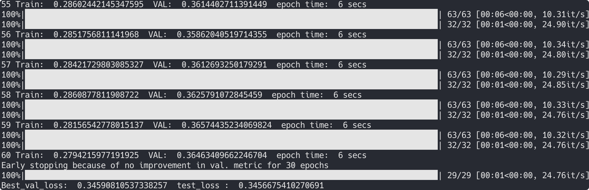

# GraFITi

## 方式一

1. 借助[工具](https://github.com/kynehc/clone_anonymous_github)下载[ GraFITi 官方代码](https://anonymous.4open.science/r/GraFITi-8F7B/README.md)至 `./GraFITi/`

2. 安装 tsdm

   1. 下载 [tsdm 官方代码](https://github.com/randolf-scholz/tsdm) 至 `./tsdm/`
   2. 创建 conda 虚拟环境，注意 `python=3.11`
   3. 用 `./GraFITi/tsdm` 替换 `./tsdm/src/tsdm`
   4. 将 `./tsdm/src/tsdm/viz/_config.py` 中的 `USE_TEX: Final[bool] = matplotlib.checkdep_usetex(True)` 改为 `USE_TEX: Final[bool] = False`
   5. 进入 `./tsdm/` 目录，执行 `pip install -e .` 

3. 修改 `./GraFITi/train_grafiti.py`

   1. 创建模型存储目录

      ```python
      if not os.path.exists('saved_models/'):
          os.makedirs('saved_models/')
      ```

   2. 修改优化器配置

      ```python
      OPTIMIZER_CONFIG = {
          "lr": ARGS.learn_rate,
          "betas": ARGS.betas,
          "weight_decay": ARGS.weight_decay,
      }
      ```

   3. 如果需要，添加 `tqdm` 打印进度条

4. 进入 `./GraFITi/` 目录，运行如下命令运行官方示例，如果提示缺包自行安装即可

```bash
python train_grafiti.py --epochs 200 --learn-rate 0.001 --batch-size 128 --attn-head 1 --latent-dim 128 --nlayers 4 --dataset physionet2012 --fold 0 -ct 36 -ft 12
```


## 方式二

1. 下载本项目
2. 创建 conda 虚拟环境，注意 `python=3.11`
3. 进入 `tsdm-main` 目录，执行 `pip install -e .` 
4. 进入 `./GraFITi/` 目录，运行如下命令运行官方示例，如果提示缺包自行安装即可

   ```bash
   python train_grafiti.py --epochs 200 --learn-rate 0.001 --batch-size 128 --attn-head 1 --latent-dim 128 --nlayers 4 --dataset physionet2012 --fold 0 -ct 36 -ft 12
   ```


## 运行结果


